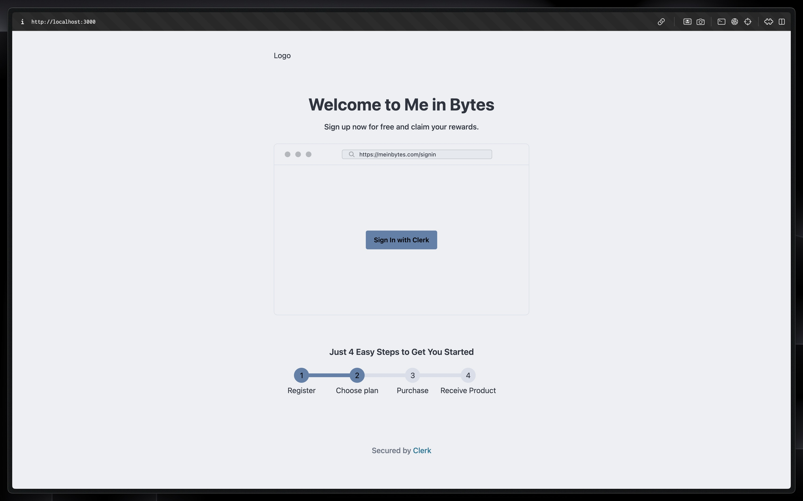

# Basic Clerk Auth + Tailwind + daisyUI in React 🔐

This project represents my personal journey in learning modern frontend tools. So far, I’ve explored and integrated the following:

- [x] 🔑 Clerk – Authentication made easy
- [x] 🎨 Tailwind CSS – Utility-first styling
- [x] 🌼 daisyUI – Beautiful component library for Tailwind

## Soon

- [ ] 🧩 React Hook Form – Efficient form handling (planned for future projects)
- [ ] 🛡️ Zod – Type-safe validation for forms
